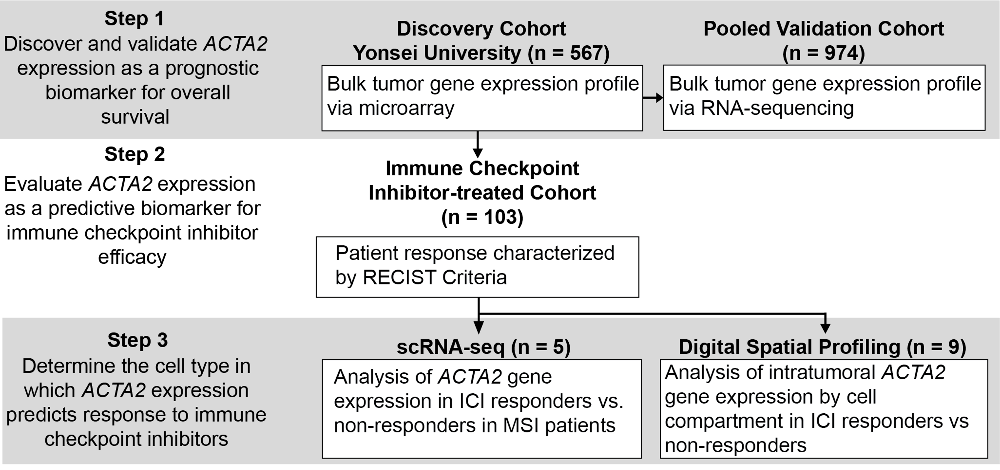

# Stromal_ACTA2_ICI_Analysis
**Overview**

This repository contains the scripts which can reproduce the main figures in the "ACTA2 expression predicts survival and response to immune checkpoint inhibitors in gastric cancer" (submited to Clinical Cancer Research).

**System requirements**

The codes require only a standard computer with enough RAM to support the in-memory operations.

**OS requirements**
The codes are tested on Windows 10.

**Installation guide**
All the scripts are tested on R (4.1.1). It might take few minutes to complete to install all the required packages.

You can use install.packages("package name") to install the packages.
The required R package: 
survminer, survival, ggplot2. 

**Demo**
Please find each script file in "codes" directory and run it in R. The datasets which are required to run each script have been included in "data" directory.

For each script, the expected output and run time are as follows
